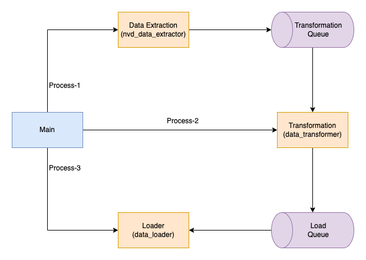

# Vulnerability Data Collection

This repository contains the code for an ETL Pipeline that extracts data from the [National Vulnerability Database](https://nvd.nist.gov/vuln/data-feeds), transforms into a format that would be usable for Data Analytics and Data Science purposes and loads it into a CSV file.

## How it works

The ETL Pipeline is divided into 3 main parts - Extractor, Transformer, and Loader.

Each part is an independent process that spawns from the parent process. To share data between each process, it uses a Queue.

---

This project uses the bare minimum resources and Data Engineering practices. Based on the requirements, it can be extended to use different technologies and tools but it does gets the work done.

---

## How to run
1. You may need to install `Python 3.11.0`. Previous versions are not tested and may not work.
2. Install the dependencies using `pip install -r requirements.txt`
3. Create a `.env` file at the root folder of the project. The file should contain 1 environment variable called `NVD_API_KEY`. Without the API Key, this code will not work. To get your API Key, visit [this page](https://nvd.nist.gov/developers/request-an-api-key).
4. Run the `main.py` file using `python main.py`

## Next steps (for me)
- [ ] Setup the monthly execution of the ETL Pipeline (maybe a Scheduled Kaggle Notebook that clones this repository and executes it. Airflow deployment is also an option but it will end up costing money.)

- [ ] Kaggle API Integration to directly update the [OSS Vulnerabilities Dataset](https://www.kaggle.com/datasets/japkeeratsingh/oss-vulnerabilities) that I maintain.
